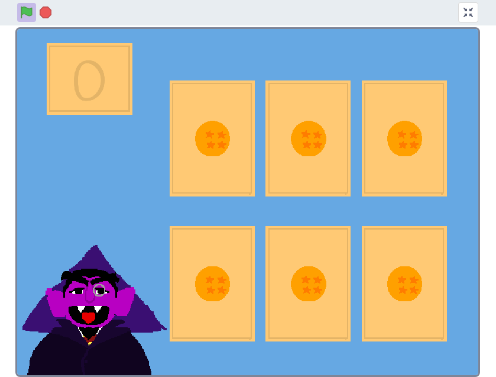

# Módulo 0: Scratch
## Enunciado:

É hora de escolher sua própria aventura! Sua tarefa, muito simplesmente, é implementar no Scratch qualquer projeto de sua escolha, seja uma história interativa, jogo, animação ou qualquer outra coisa, sujeito apenas aos seguintes requisitos: 

- Seu projeto deve ter pelo menos dois sprites, pelo menos um deles deve se parecer com algo diferente de um gato.
- Seu projeto deve ter pelo menos três scripts no total (ou seja, não necessariamente três por sprite).
- Seu projeto deve usar pelo menos uma condição.
- Seu projeto deve usar pelo menos um loop.
- Seu projeto deve usar pelo menos uma variável.
- Seu projeto deve usar pelo menos um som.
- Seu projeto deve ser mais complexo do que a maioria dos demonstrados na aula (muitos dos quais, embora instrutivos, foram bastante curtos), mas pode ser menos complexo do que o Ivy’s Hardest Game. Como tal, seu projeto provavelmente deve usar algumas dezenas de peças do quebra-cabeça no geral.

Se você gostaria de se inspirar em projetos do Scratch de alunos anteriores, aqui estão alguns:

It's Raining Men, da palestra;

Ivy's Hardest Game, um jogo, edição Harvard;

Soccer, um jogo;

Cookie Love Story, uma animação;

Gingerbread Tales, uma história interativa;

Dinossaur, um jogo;

Oscartime, um jogo.

Você pode achar esses tutoriais ou projetos iniciantes úteis. E você é bem-vindo a explorar scratch.mit.edu para se inspirar. Mas tente pensar em uma ideia por conta própria e, em seguida, comece a implementá-la. No entanto, não tente implementar todo o seu projeto de uma vez: vá uma peça de cada vez. Em outras palavras, dê passos pequenos: escreva um pouco de código (ou seja, arraste e solte algumas peças do quebra-cabeça), teste, escreva um pouco mais, teste e assim por diante. E selecione Arquivo > Salvar Agora a cada poucos minutos para que você não perca nenhum trabalho!
    
  Se, ao longo do caminho, você achar que é muito difícil implementar algum recurso, tente não se preocupar; alterar seu design ou contornar o problema. Se você se propõe a implementar uma ideia que acha divertida, é provável que não ache muito difícil satisfazer os requisitos acima.
    
  Tudo bem, pode ir. Nos deixe orgulhosos!

## Solução:

Para este desafio, escolhi desenvolver um projeto inspirado em um dos personagens do programa Vila Sésamo: o Conde von Conde, famoso pelo amor à contagem.
    
  Desta forma, o projeto "1,2,3... Couting", estruturado como jogo, apresenta cartas de pokébolas e esferas do dragão que devem ser escolhidas - contadas - conforme o pedido do Conde Drácula dos Muppets.

  
O projeto pode ser acessado através do seguinte link pelo Scratch:  
🔗 [Abrir no Scratch](https://scratch.mit.edu/projects/1131066456)  

Ou pode ser baixado aqui:  
📥 [Baixar o projeto](Modulo0/1,2,3...%20Couting.sb3)

  
  
